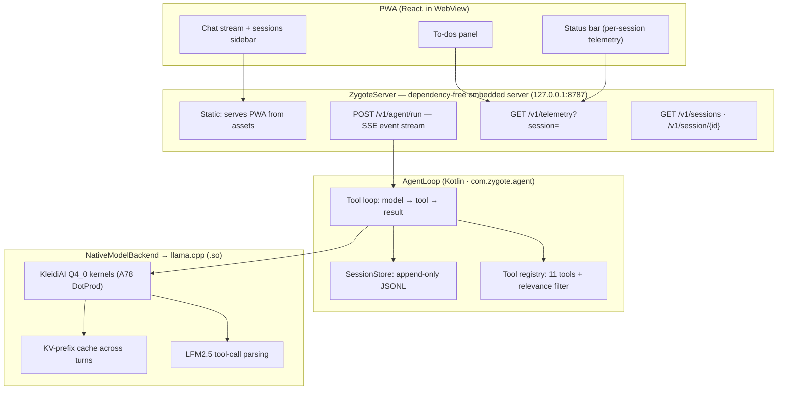

# Zygote

**A private, on-device agent harness for Arm phones.**

Zygote is a native Android agent that runs entirely on-device: no cloud, no server, no data leaving the phone. It combines a Kotlin agent harness (DeepSeek-Harness and opencode-inspired loop), llama.cpp inference with Arm KleidiAI kernels, a dependency-free embedded HTTP server, and a hyper-minimal progressive web app (PWA) interface modeled on the DeepSeek Harness web UI.

Built for the **Arm Create: AI Optimization Challenge, Track 3 (Mobile AI)**, targeting a $150 Samsung Galaxy M17 (SM-M176B, Exynos 1330, 2×Cortex-A78 + 6×Cortex-A55, no neural processing unit (NPU), 8 GB RAM).



## Why it matters

- **Truly on-device.** The 1.2B model runs 100% local. `ZygoteServer` binds `127.0.0.1` only, so nothing leaves the device.
- **Fast on cheap hardware.** Measured on the $150 phone: **14.7 tok/s decode, 67 tok/s prefill (pp128), ~1.7s warm time-to-first-token (TTFT)** with native key-value (KV) prefix caching, 62% faster than the ~4.6s cold path.
- **Agentic, not chat-only.** 11 tools (screen reading, tap, type, swipe, open app, call, SMS, shell, todos), LFM2.5 native tool-call parsing, per-session todos.
- **Honest telemetry.** Every number in the status bar is measured on-device and scoped per session. No invented cache-hit percentages.

## Models

Two tiers, both measured on the phone with the benchmark instrument (pp 128, tg 64, cold):

| Model | Role | Size | Prefill (pp128) | Decode (tg64) |
|---|---|---|---|---|
| LFM2.5-230M Q4_0 | fast router: intent classification | 142 MB | 251 tok/s | 51.1 tok/s |
| LFM2.5-1.2B-Instruct Q4_0 | main agent | 664 MB | 67 tok/s | 14.7 tok/s |

The 2.6B tier was evaluated and dropped: it delivered ~7 tok/s on this phone, and its tool-call reliability did not justify the wait. The 230M is Liquid's data-extraction model, so it is not a chat model; it runs as the fast router tier (2 ms intent classification at 251 tok/s prefill) and as the speculative-decoding draft when enabled. LFM2.5-1.2B-Instruct is Liquid's recommended pick for general use, verified on-device with the full agent loop including tool calling.

Download: `hf download LiquidAI/LFM2.5-1.2B-Instruct-GGUF LFM2.5-1.2B-Instruct-Q4_0.gguf --local-dir models/`

## Build

Prerequisites: Android SDK and NDK, JDK 17, CMake 3.22 or newer, a checkout of [llama.cpp](https://github.com/ggml-org/llama.cpp) with the local Zygote patch applied (see below), and `GGML_OPENMP=ON` with `GGML_CPU_KLEIDIAI=ON`.

```bash
# 1. llama.cpp must live at <your_repo_root>/llama.cpp (CMake references it relatively)
git clone https://github.com/ggml-org/llama.cpp.git

# 2. Apply the Zygote patch (LFM2 recurrent-state rollback for KV-prefix caching)
git -C llama.cpp apply ../patches/llama-arch-lfm2-rs-rollback.patch

# 3. Build the app
cd zygote-app
export JAVA_HOME=<your_jdk17_path>
./gradlew :app:assembleDebug

# 4. Push models + install
adb push ../models/LFM2.5-1.2B-Instruct-Q4_0.gguf /sdcard/zygote-models/
bash ../scripts/setup_device.sh
```

> **Note on the llama.cpp fork:** Zygote enables `n_rs_seq` rollback for the LFM2 (Gated DeltaNet) architecture so the native KV-prefix cache can trim divergent tails between turns. This is a 2-case addition to `llm_arch_supports_rs_rollback()`, included as a patch in `patches/`. It is a local build change, not an upstream contribution.

## Architecture notes

- **AgentLoop** (`lib/src/main/java/com/zygote/agent/`) implements the skill-picker pattern: the model never performs actions itself, it picks a tool and arguments, and the harness executes and feeds results back. LFM2.5's `<|tool_call_start|>[fn(args)]<|tool_call_end|>` format is parsed natively, including multi-call blocks.
- **Sessions** use append-only JSON Lines (JSONL) per session (Claude Code style), one event per line with a monotonic `seq` (opencode style). Admission-first: the user message is durably logged before the model runs, so nothing is lost on crash. Resume equals replay.
- **KV-prefix cache** (`ai_chat.cpp`) reuses the byte-identical prompt prefix every turn: only the suffix is re-prefilled, and the divergent KV tail is trimmed via `llama_memory_seq_rm` with bounded recurrent-state rollback. Warm TTFT: **~1.7s vs ~4.6s cold (−62%)**.
- **Thread split** (decode 4, prefill 8): decode is a memory-bandwidth-bound general matrix-vector multiply (GEMV), so 4 threads measured 14.7 tok/s where 7 threads measured 4.07 tok/s. Prefill is compute-bound general matrix-matrix multiply (GEMM), where 8 threads measured 67 tok/s vs 45.7 at 4 threads. The split gets both maxima.
- **Relevance-filtered tools** inject only the tools relevant to the current request (Liquid's recommendation), cutting prefill tokens 5-10× on short turns.
- **Telemetry** reports per-session counters, segment-accurate tok/s (tool-gap time excluded), and real RAM and battery from the device. No hardcoded values.

## Verification

Ad-hoc verification scripts live in `harness/verify/` and proofs in `harness/proof/` (SPINE, PHONETOOLS, BENCHMARK, PWA). The full `connectedDebugAndroidTest` suite is deliberately avoided: it wipes app data on this device. The verification model is script-driven against a live device with models in shared storage (`scripts/setup_device.sh`).

## Known issues

See [GitHub Issues](https://github.com/system1970/zygote/issues) for the live list. Highlights:

- Session API edge cases (resume and replay of tool-result turns)
- Message rendering: an aborted run can leave the turn-ref pointing at the previous assistant bubble (mitigated, regression-tested ad-hoc)
- Hybrid KV-cache rollback window (`n_rs_seq` = 256): trims beyond it fall back to full re-decode
- The 1.2B occasionally emits malformed tool calls; the parser is regex-based with no nested-quote arguments yet
- No vision support yet (the VL model is not wired into llama.cpp MTMD)

## License

MIT
